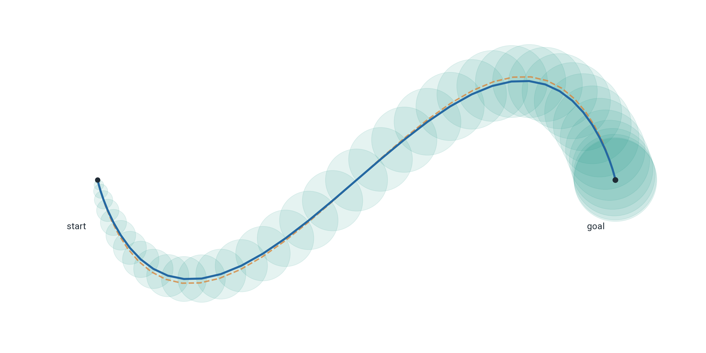
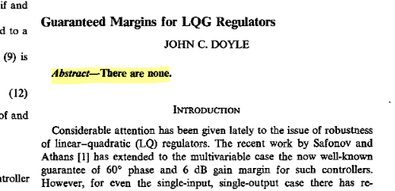
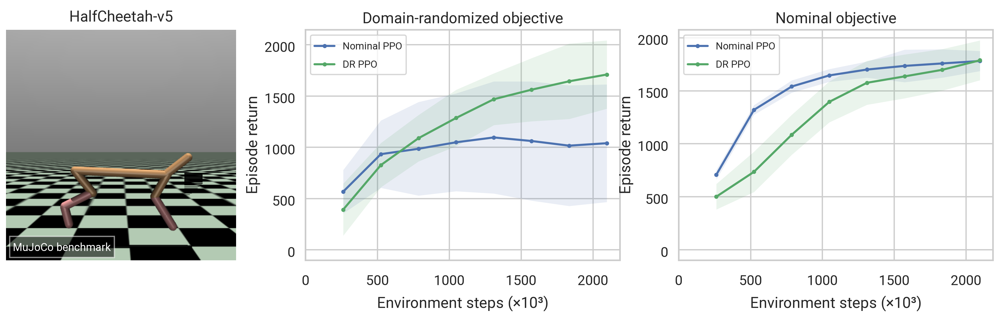
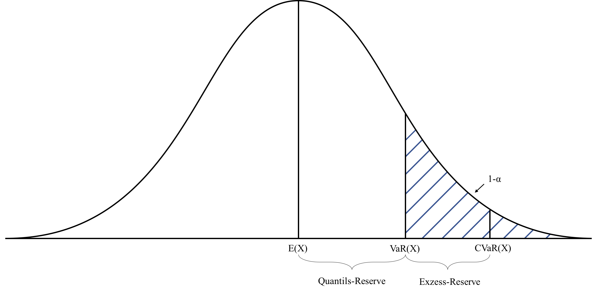

# Last Time: Trajectory Optimization

Here is a general form of discrete-time trajectory optimization:

\begin{align*}
    \min_{x_{0:T}, u_{0:T-1}} &\; c_T(x_T) + \sum_{t=0}^{T-1} c(x_t, u_t) \\
    \text{s.t.} &\; x_{t+1} = f(x_t, u_t), \quad x_0 = x_\text{init},
\end{align*}

# A Quadrotor Example

Say we want to find a minimum length trajectory for a quadrotor to get from point A to point B:

{width=50%}

**Question:** *what could go wrong?*

# Defining a Stochastic Control System

Previously:
$$ x_{t+1} = f(x_t, u_t), \qquad x_0 = x_\text{init} $$

Now:
$$ x_{t+1} = f(x_t, u_t, w_t), \qquad x_0 \sim p(x_0), $$
where $w_t$ is a random process.

<!-- 
NOTE: can model things like disturbances, parameter uncertainty, etc
Also, w_t don't need to be independent.
-->

# Continuous vs Discrete

We can talk about stochastic systems in either continuous or discrete time. For simplicity, this lecture mostly focuses on discrete time. 

In continuous time, you deal with **stochastic differential equations**, and have to worry about Itô's lemma, which describes how the chain rule works for SDE's.

<!-- *For example,* if $W_t$ is brownian noise, it follows from Itô's lemma that:
$$ d\Big[W_t^2\Big] = 2 W_t d W_t + dt $$ -->

# Example: Stochastic LTI

Consider:
$$ x_{t+1} = A x_t + B u_t + w_t, \qquad w_t \sim \mathcal N(0, \Sigma) $$
For some noise covariance $\Sigma = \Sigma^\top \succ 0$

**Note:** *if $x_0$ is a Gaussian and $u_t$ is an affine function of $x_t$, then all $x_t$ are Gaussian.*

Let $u_t = K x_t$ such that $\rho(A + BK) < 1$.

**Question:** Does the system have a fixed point at $x = 0$?

<!-- 
ANSWER: no not really
 -->

# Stationary Distributions

For stochastic systems, it often makes more sense to talk about a *stationary distribution* as opposed to a stationary point.

{width=80%}

**Question:** *For the SLTI system, if $x_0 = 0$, what happens to $x_t$ as $t \to \infty$?*
$$ x_{t+1} = (A + BK) x_t + w_t, \qquad w_t \sim \mathcal N(0, \Sigma) \text{ I.I.D.} $$

<!-- 
ANSWER: x_t \to N(0, P), where P satisfies P = A_* P A_*^T + \Sigma.
-->

# Example: Polytope Uncertainty and LTI

Consider:
$$ x_{t+1} = (A + BK) x_t + w_t, \qquad w_t \in \mathcal W, $$
where $\mathcal W \subset \mathbb R^n$ is a convex polytope and $x_0 = 0$.

The *Minkowski sum* of two sets is 
$$ \mathcal X \oplus \mathcal W = \{x + w: x \in \mathcal X \; w \in \mathcal W\} $$

Also define $A \mathcal X = \{Ax: x \in \mathcal X\}$ for matrix $A$ and set $\mathcal X$.

Then our set-valued dynamics are:
$$ \mathcal X_{t+1} = (A + BK) \mathcal X_t \oplus \mathcal W $$
We can track the convex polytope $\mathcal X_{t}$ by its vertices $\{v_x^{(1)}, ..., v_x^{(m)}\}$

<!-- For $t=1, ..., T$:

1. Set empty vertex set $X_t \gets \emptyset$
2. For each $x \in X_{t-1}$ and $w \in W$, add $x + w$ to $X_t$
3. filter out points in the interior of $\text{Hull}(X_t)$. -->

# Zonotopes

Things are easier if our sets are *Zonotopes*, defined:
$$ \mathcal Z(c, G) = \left\{c + \sum_{i=1}^m z_i g_i: z_i \in [-1, 1]\right\}$$
Then, the Minkowski sum becomes:
$$ \mathcal Z(c, G) \oplus \mathcal Z(c', G') = \mathcal Z(c + c', [G,\;G']) $$
So, if $\mathcal X_t = \mathcal Z(c_x, G_x)$ and $\mathcal W = \mathcal Z(c_w, G_w)$, we get:
$$ \mathcal X_{t+1} = \mathcal Z\Big((A + BK) c_x + c_w, \big[(A + BK)G_x,\;G_w\big]\Big) $$

# Example: Zonotope evolution

{width=80%}

**Takeaway:** *We can think about propagating sets through dynamics to model uncertainty*

# Example: Manipulator Equations with Uncertainty

Recall:
$$ M(q)\ddot q + C(q, \dot q)\dot q + g(q) = B u $$

We might have uncertainty about physical parameters (e.g. mass, friction). We can represent those by $\xi$:
$$ M(q, \xi)\ddot q + C(q, \dot q, \xi)\dot q + g(q, \xi) = B u $$
Then we would get the system:
$$ \begin{bmatrix} \dot q \\ \ddot q \end{bmatrix} = \begin{bmatrix} \dot q \\ M(q, \xi)^{-1} \left( B u - C(q, \dot q, \xi) \dot q - g(q, \xi)\right) \end{bmatrix}$$
where our random process, $w_t = \xi$, is a random constant (over time).

# Disturbances vs Uncertainty about Parameters

Stochastic system:
$$ x_{t+1} = f(x_t, u_t, w_t), \qquad x_0 \sim p(x_0), $$
We might want to separate random parameters $\xi$ that remain constant over time:
$$ x_{t+1} = f(x_t, u_t, w_t, \xi), \qquad x_0 \sim p(x_0) $$
where $\xi$ is a random variable

**Note:** *Random parameters can be wrapped into the state by creating an augmented state (but then your controller loses full observability)* 

# Stochastic and Robust Optimal Control

$$ x_{t+1} = f(x_t, u_t, w_t), \qquad x_0 \sim p(x_0), $$

Let $\pi \in \Pi$ be a (possibly time-varying) policy (for trajectory optimization, this is the control inputs $u_0, u_1, ..., u_{T-1}$).

Let $J(\pi; w_{0:T-1})$ be a cost function over policies based on $w_{0:T-1}$. 

**Question:** *What objective should we optimize?*

Average case?
$$ \min_{\pi \in \Pi} \; \mathbb E_w J(\pi; w_{0:T-1}) $$

Worst case?
$$ \min_{\pi \in \Pi} \; \max_{w_{0:T-1} \in \mathcal W} J(\pi; w_{0:T-1}) $$

# Ex: Stoch. Trajectory Optimization via Sampling

Consider a stochastic trajectory optimization problem:
\begin{align*}
    \min_{X_{0:T}, u_{0:T-1}} &\; \mathbb E \left[ c_T(X_T) + \sum_{t=0}^{T-1} c(X_t, u_t) \right] \\
    \text{s.t.} &\; X_{t+1} = f(X_t, u_t, W_t), \quad X_0 = x_\text{init},
\end{align*}
An easy way to approximate this is to sample $\left\{w^{(i)}_t\right\}$ and solve:
\begin{align*}
    \min_{x_{0:T}^{(i)}, u_{0:T-1}} &\; \frac{1}{n}\sum_{i=1}^n \left[ c_T(x_T^{(i)}) + \sum_{t=0}^{T-1} c(x_t^{(i)}, u_t) \right] \\
    \text{s.t.} &\; x^{(i)}_{t+1} = f(x_t^{(i)}, u_t, w_t^{(i)}), \quad x_0^{(i)} = x_\text{init}
\end{align*}

**Question:** *why might sharing the $u_t$ between samples be conservative?*

<!-- **Question:** *does this work for the robust version?* -->

# Example: Robust TO with Finite Uncertainty Set

If our uncertainty is drawn from a finite set, $\{ \xi^{(1)}, ..., \xi^{(n)} \}$, then we can do a similar thing:
\begin{align*}
    \min_{x_{0:T}^{(i)}, u_{0:T-1}} &\; \max_{i \in 1, ..., n} \left\{ c_T(x_T^{(i)}) + \sum_{t=0}^{T-1} c(x_t^{(i)}, u_t) \right\} \\
    \text{s.t.} &\; x^{(i)}_{t+1} = f(x_t^{(i)}, u_t, \xi^{(i)}), \quad x_0^{(i)} = x_\text{init}
\end{align*}

**Question:** *why doesn't this work for sampling from an uncertainty set?*

# Example: Tube Trajectory Optimization

Consider a bounded uncertainty set $\mathcal W$ and linearized dynamics around a nominal trajectory with error feedback.

We want to optimize a *tube* around it so that we are guaranteed to remain in the tube. We pick an invariant set $\mathcal E$ and can formulate:
\begin{align*}
    \min_{\bar x_{0:T}, \bar u_{0:T-1}, \alpha_{0:T}} &\; c_T(\bar x_T) + \sum_{t=0}^{T-1} c(\bar x_t, \bar u_t) + \sum_{t=1}^T \gamma \alpha_t \\
    \text{s.t.} &\; \bar x_{t+1} = A_t \bar x_t + B_t \bar u_t \quad \bar x_0 = x_\text{init} \\
    &\; \alpha_{t+1} \mathcal E \supseteq (A_t + B_t K_t) (\alpha_t \mathcal E) \oplus \mathcal W \quad \alpha_t \geq 0 \\
    &\; \bar x_t + \alpha_t \mathcal E \subseteq \mathcal X, \quad \bar u_t + K_t (\alpha_t \mathcal E) \subseteq \mathcal U 
\end{align*}

If $\mathcal E = \{x \in \mathbb R^d: \|x\| \leq 1\}$ and $\mathcal W$ has radius $r_w$, the tube dynamics constraint becomes:
$$ \alpha_{t+1} \geq \| A_t + B_t K_t \|_2 \alpha_t + r_w $$

# Example: Tube Trajectory Optimization

**Note:** *Under deterministic dynamics and initialization, feedback during trajectory optimization has no effect, but under uncertainty, feedback matters.*

# Chance Constraints

We don't always just care about the objective; we may also want *constraints* to be satisfied (think about the quadrotor).

However, a hard constraint like:
$$ g(x_t, u_t) \leq 0 $$
might not be feasible in stochastic systems (e.g. Gaussian noise)

Instead, we can express a *chance constraint* as:
$$ P\left[g(x_t, u_t, w_t) \leq 0\right] \geq 1-\alpha $$

# How to Actually Solve Chance Constraints

Consider traj. opt. with a linear chance constraint for $a^\top x + b^\top u \leq c$:
\begin{align*}
    \min_{X_{0:T}, u_{0:T-1}} &\; \mathbb E \left[ c_T(X_T) + \sum_{t=0}^{T-1} c(X_t, u_t) \right] \\
    \text{s.t.} &\; X_{t+1} = f(X_t, u_t, W_t), \quad X_0 = x_\text{init} \\
    &\; P\left[ a^\top X_t + b^\top u_t \leq c \right] \geq 1-\alpha
\end{align*}
For linear dynamics and Gaussian distributions, the constraint is:
$$ a^\top \mu_{X_t} + \Phi^{-1} (1 - \alpha) \sqrt{a^\top \Sigma_{X_t} a} + b^\top u_t \leq c$$

We can sample to solve a general chance constraint for small $\alpha$:
$$ g(x^{(i)}_t, u_t, w^{(i)}_t) \leq 0, \quad \forall i, t $$
If we have at least $M^*(\alpha, \delta, d)$ samples, then if we satisfy these constraints, the chance constraint is satisfied w.p. at least $1-\delta$.

<!-- - sampling
- propogate a parametric distribution (e.g. Gaussian) and put quantile constraints
- Show example of optimization problem -->

# Stochastic Value Function

Let $w_0, w_1, ...$ be IID from $p(w)$.

Consider cost $c(x, u, w)$. 

The cost-to-go or value function is:
\begin{align*}
V(x) &\;= \min_{\pi} \mathbb E_{w_{0:\infty}} \left[\sum^\infty_{t=0} \gamma^t c(x_t, u_t)\right] \\
&\;= \min_u \mathbb E_w \left[ c(x, u, w) + \gamma \min_{\pi} \mathbb E_{w_{1:\infty}}\left[ \sum_{t=1}^\infty \gamma^{t-1} c(x_t, u_t) \right]   \right] \\
&\;= \min_u \mathbb E_w \Big[c(x, u, w) + \gamma V(f(x, u, w))\Big]
\end{align*}

**Question:** *why did we assume IID disturbance?*

# Robust Value Function

Let $(w_0, w_1, ...) \in \mathcal W \times \mathcal W \times ...$; this is a *rectangular* uncertainty set.

With a cost $c(x, u, w)$, we can similarly derive a Bellman equation:
$$ V(x) = \min_u \max_w \Big\{ c(x, u, w) + \gamma V(f(x, u, w)) \Big\} $$

# Example: Stochastic LQR

$$ x_{t+1} = A x_t + B u_t + w_t, \qquad w_t \sim \mathcal N(0, \Sigma) $$
Consider the cost: 
$$ c(x, u) = x^\top Q x + u^\top R u, $$ 
for $Q = Q^\top \succeq 0$ and $R = R^\top \succ 0$. 

Then, our value function is:
$$ V(x) = \min_u \mathbb E_w \left[ x^\top Q x + u^\top R u + \gamma V(Ax + Bu + w) \right] $$

# Example: Stochastic LQR
Let's assume our optimal policy is $u_t = K x_t$

and our value function is $V(x) = x^\top S x + c$ for some $S = S^\top \succeq 0$ and $c$. 

Then, we get:
$$ S = Q + \gamma A^\top S A - \gamma^2 A^\top S B(R + \gamma B^\top S B)^{-1} B^\top S A $$
$$ c = \frac{\gamma}{1-\gamma} \mathbb E_w [w^\top S w] = \frac{\gamma}{1-\gamma} \text{tr}(S \Sigma) $$

**Question:** *what happens if $\gamma=1$?*

# Observability

Our current formulation, 
$$ x_{t+1} = f(x_t, u_t, w_t) $$ 
doesn't give us uncertainty about state from partial-observability. This requires introducing observations:
$$ y_t = h(x_t, u_t, v_t) $$
where $v_t$ is a stochastic process handling measurement noise.

<!-- **Note:** *We can now model a partially-observable markov decision processes.*

# Aside: Partially Observable Markov Decision Processes

A POMDP is a tuple $(\mathcal S, \mathcal A, \mathcal O, T, O, R, \gamma)$ where:

|Symbol| Meaning|
| - | - |
| $\mathcal S$ | the set of states |
| $\mathcal A$ | the set of actions |
| $\mathcal O$ | the set of observations |
| $T(s_{t+1} | s_t, a_t)$ | the distribution over state transitions |
| $O(o_{t+1} | s_{t+1}, a_t)$ |the distribution over observations |
| $R(s_t, a_t)$ | the reward model |
| $\gamma \in [0, 1]$| the discount rate | -->

# Example: LQG

$$ x_{t+1} = A x_t + B u_t + w_t, \qquad w_t \sim \mathcal N(0, \Sigma) $$
We can extend our stoch. LTI system to have uncertain observations:
$$ y_t = C x_t + v_t, \qquad v_t \sim \mathcal N (0, \Omega) $$
Then, we arrive at a *Kalman filter*. 

Adding a Kalman filter in LQR gives *LQG*, where we track *belief* $(\hat x, P)$:
\begin{align*}
\hat{x}_{t|t-1} &= A\hat{x}_{t-1|t-1} + Bu_{t-1}, \\
P_{t|t-1} &= AP_{t-1|t-1}A^\top + \Sigma, \\
L_t &= P_{t|t-1}C^\top
      \left(CP_{t|t-1}C^\top + \Omega\right)^{-1}, \\
\hat{x}_{t|t} &= \hat{x}_{t|t-1}
      + L_t\left(y_t-C\hat{x}_{t|t-1}\right), \\
P_{t|t} &= (I-L_tC)P_{t|t-1}, \\
u_t &= K^* \hat{x}_{t|t}.
\end{align*}

# The Margins of LQG

# $H_\infty$ Control

Consider a closed-loop system under policy $\pi$ with disturbances $w(t)$ and cost-relevant outputs $z(t)$:
$$ \dot x(t) = f_\pi (x(t), w(t)), \qquad z(t) = h_\pi (x(t), w(t)) $$

Define a norm over a time-varying function:
$$ \left\| x(\cdot) \right\|_{L_2} = \sqrt{\int_0^\infty x(t)^\top x(t) dt} $$

The $H_\infty$ problem is then (assume $x(0) = 0$):
$$ \min_{\pi \in \Pi} \; \max_{\|w\|_{L_2} \neq 0} \; \frac{\|z(\cdot)\|_{L_2}}{\|w(\cdot)\|_{L_2}} $$

# Lyapunov Functions as Certificates in $H_\infty$ Control

Suppose we want to build a certificate of our objective:
$$ \max_{\|w\|_{L_2} \neq 0} \frac{\|z(\cdot)\|_{L_2}}{\|w(\cdot)\|_{L_2}} \le \gamma. $$
This is equivalent to saying the following holds for all $\|w\|_{L_2}$:
$$ \|z(\cdot)\|_{L_2}^2 - \gamma^2 \|w(\cdot)\|_{L_2}^2 \le 0. $$

We can certify this with a Lyapunov function $V(x)$ satisfying:
$$ \dot V(x) + z(t)^\top z(t) - \gamma^2 w(t)^\top w(t) \le 0. $$
For all $w(\cdot)$. (and $V(0) = 0$ and $V(x) \geq 0$)

# Example: Domain Randomization in RL

Reinforcement learning with domain randomization tries to minimize some cost:
$$ J(\theta) = -\mathbb E_\xi \mathbb E_{\tau \sim \pi_\theta, \xi} \left[ \sum_{t=1}^T \gamma^t r(x_t, u_t) \right] $$
where $\xi$ are random domains (friction, etc.)

**Example:**

# Other Measures of Risk: VaR and CVaR

Let $J$ be a random variable denoting some sort of cost (e.g. the trajectory cost over $w_t$). Maybe we don't want to just focus on $\mathbb E J$.

The value-at-risk at level $\alpha$ is a quantile:
$$ \operatorname{VaR}_\alpha(J) = \min \{ z : \mathbb P(J \le z) \ge \alpha \} $$
The conditional value-at-risk for continuous distributions is the expected tail cost:
$$ \operatorname{CVaR}_\alpha(J) = \mathbb E[J \mid J \ge \operatorname{VaR}_\alpha(J)] $$

{width=70%}

# Distributionally Robust Control

We could also strike a balance between worst-case and expectational objectives by minimizing over an *ambiguity set* of distributions:
$$ \min_\pi \max_{Q \in \mathcal{Q}} \mathbb{E}_Q \left[J(\pi; w)\right] $$
where $\mathcal{Q}$ is a set of probability distributions.

**Example:** A KL ball:
$$ \mathcal{Q} = \left\{ Q \in \Delta^{\mathcal{W}} : D_\text{KL}(Q \| P) \leq \epsilon \right\} $$

# Conclusion

**Feedback matters**

- In uncertain systems, feedback acts to steer the distribution, preventing over-conservatism.

**Stochastic/Robust problems are harder to solve**

- More variables; more hyperparameters
- Often non-convex.

**There are many practical techniques for solving**

- Linearizing systems with Gaussian noise or Zonotopes
- Sampling
- Tube trajectory optimization
- Handling chance constraints
- etc.
